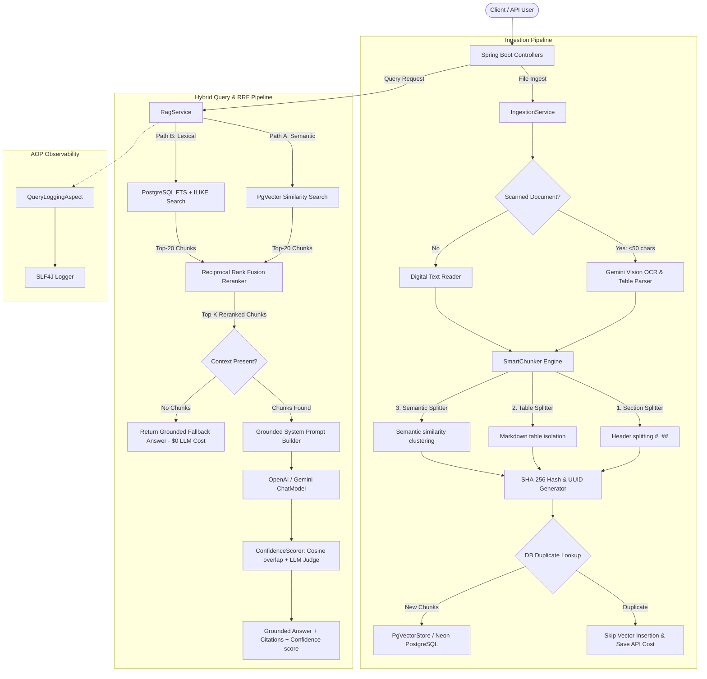

# Cost-Efficient RAG Application

A high-performance, cost-optimized Retrieval-Augmented Generation (RAG) backend application built with **Spring Boot 3.3.5**, **Java 17**, **Spring AI (1.0.0-M1)**, and **PgVector** (hosted on Cloud Neon PostgreSQL).

---

### Key Features

1. **Idempotent Document Ingestion & Multimodal OCR**:
   - Supports **PDF**, **HTML**, **Markdown**, and **Text** format ingestion.
   - **Scanned PDF Detection & Vision OCR**: Automated page renderer converting scanned pages to 150 DPI images and dispatching to **Gemini 1.5 Flash** for verbatim text extraction and structured Markdown tables transcription.
   - **SHA-256 Chunk Deduplication**: Computes text content hashes to generate deterministic UUIDs, performing fast database lookups to skip already embedded chunks to save OpenAI embedding costs.

2. **Smart Chunking Engine**:
   - **Section-Aware Headers**: Splitting based on Markdown headers (`#`, `##`, `###`) to preserve topic boundaries.
   - **Table-Aware Extractor**: Identifying Markdown tables and keeping them whole as single chunks to avoid row misalignment.
   - **Semantic Sentence Clustering**: Tokenizing sentences and dynamically grouping them using vector similarity (threshold $0.82$) to preserve meaning.

3. **Grounded LLM Search & Zero-Hallucination Fallback**:
   - **Zero-Context Fallback**: Skips LLM calls if retrieved context is below threshold.
   - **Grounded Prompting**: Strict facts-only prompting enforcing citations formatting.

4. **Hybrid Retrieval & RRF Reranking**:
   - **Dual Retrieval Path**: Executes simultaneous semantic PgVector similarity search and sparse PostgreSQL Full-Text Search (FTS with tsvector/tsquery + `ILIKE` fallbacks).
   - **Reciprocal Rank Fusion (RRF)**: Merges rank outcomes with a standard constant factor ($k=60$) to bubble up both semantic matches and exact terminology terms.

5. **Confidence Scoring & Hallucination Guard**:
   - **Dual Confidence Fusion**: Combines cosine similarity overlap between generated answer and context chunks (30%) and LLM-as-a-Judge groundedness rating (70%) to output a 0-100% confidence level.

6. **Performance & Token Usage AOP Interceptor**:
   - Spring AOP (`QueryLoggingAspect`) measures and logs query latency, chunk counts, grounded status, and OpenAI token consumption.

7. **Automated Evaluation Suite (IR Metrics + LLM-as-a-Judge)**:
   - Automated run of 15 test cases evaluating **Recall@K**, **MRR**, **nDCG@K**, **Context Precision**, **Faithfulness**, and **Answer Relevance**.

---

## System Architecture



---

## Quick Start Guide

### 1. Prerequisites
- **Java 17** or higher installed.
- **Maven 3.8+** installed.
- **OpenAI API Key** (or set environment variable `SPRING_AI_OPENAI_API_KEY`).
- **PostgreSQL with PgVector extension** (default pre-configured with Neon PostgreSQL).

### 2. Configuration (`application.yaml`)

Configure your database and OpenAI settings in `src/main/resources/application.yaml`:

```yaml
spring:
  application:
    name: cost-efficient-rag

  datasource:
    url: jdbc:postgresql://<neon-db-host>/neondb?sslmode=require
    username: <db_username>
    password: <db_password>
    driver-class-name: org.postgresql.Driver

  ai:
    openai:
      api-key: ${SPRING_AI_OPENAI_API_KEY:your-openai-api-key}
      embedding:
        options:
          model: text-embedding-3-small
    vectorstore:
      pgvector:
        table-name: vector_store
        initialize-schema: true
        index-type: HNSW
        distance-type: COSINE_DISTANCE

rag:
  chunking:
    default-chunk-size: 512
    default-chunk-overlap: 64
```

### 3. Build & Run Application

```bash
# Build project
mvn clean compile

# Run unit and integration tests
mvn test

# Start local server
mvn spring-boot:run
```

The application starts on port `8080` by default.

---

## API Reference

### 1. Ingest File Document
`POST /api/v1/ingest/file` (`multipart/form-data`)

**Form Parameters:**
- `file`: Multipart file (`PDF`, `HTML`, `Markdown`, `Text`)
- `documentType` *(optional)*: Override document format (`PDF`, `HTML`, `MARKDOWN`, `TEXT`)
- `chunkSize` *(optional)*: Override chunk size (default 512)
- `chunkOverlap` *(optional)*: Override chunk overlap (default 64)

**Sample Response:**
```json
{
  "success": true,
  "message": "Successfully ingested 'sample.pdf'. Processed 4 chunks (4 inserted, 0 duplicate skipped).",
  "documentName": "sample.pdf",
  "totalChunksProcessed": 4,
  "newChunksInserted": 4,
  "duplicateChunksSkipped": 0,
  "chunkHashes": ["a1b2c3...", "d4e5f6..."],
  "timestamp": "2026-08-11T23:45:00"
}
```

### 2. Ingest Raw Text / JSON
`POST /api/v1/ingest/text` (`application/json`)

**Request Payload:**
```json
{
  "content": "Spring AI provides generic interfaces for vector databases and embedding models.",
  "documentType": "TEXT",
  "documentName": "sample_text.txt",
  "chunkSize": 512,
  "chunkOverlap": 64
}
```

---

### 3. Execute RAG Search & Grounded Generation
`POST /api/v1/rag/query` (`application/json`)

**Request Payload:**
```json
{
  "query": "What is Spring AI?",
  "topK": 3,
  "similarityThreshold": 0.0,
  "metadataFilter": ""
}
```

**Sample Response:**
```json
{
  "answer": "Spring AI provides generic interfaces for vector databases and embedding models [Doc 1, sample_text.txt].",
  "citations": [
    {
      "filename": "sample_text.txt",
      "chunkId": "12345678-1234-1234-1234-123456789abc",
      "sha256Hash": "a1b2c3...",
      "chunkIndex": 0,
      "snippet": "Spring AI provides generic interfaces..."
    }
  ],
  "retrievedChunkCount": 1,
  "executionLatencyMs": 145,
  "tokenUsage": {
    "promptTokens": 52,
    "completionTokens": 18,
    "totalTokens": 70
  },
  "grounded": true
}
```

---

### 4. Run Automated Evaluation Suite
`POST /api/v1/eval/run` (`application/json`)

**Request Payload:**
```json
{
  "k": 3
}
```

**Sample Response:**
```json
{
  "totalTestCases": 15,
  "meanRecallAtK": 0.933,
  "meanMrr": 0.887,
  "meanNdcgAtK": 0.912,
  "meanContextPrecision": 0.866,
  "meanFaithfulness": 0.950,
  "meanAnswerRelevance": 0.933,
  "p50LatencyMs": 140.0,
  "p95LatencyMs": 320.0,
  "timestamp": "2026-08-11T23:45:00"
}
```

---

### 5. Get Cost Analysis Projections
`GET /api/v1/cost/analysis` (`application/json`)

**Sample Response:**
```json
{
  "assumptions": {
    "embeddingModel": "text-embedding-3-small",
    "vectorDimensions": 1536,
    "bytesPerVectorWithIndex": 8192,
    "monthlyQueryVolume": 50000,
    "pgVectorProvider": "Neon Serverless PostgreSQL (HNSW index)",
    "managedVectorDbProvider": "Pinecone Standard Pod / Managed Cluster"
  },
  "projections": [
    {
      "scaleTier": "100K",
      "vectorCount": 100000,
      "storageGb": 0.8,
      "pgVectorMonthlyCostUsd": 10.0,
      "managedDbMonthlyCostUsd": 70.0,
      "monthlySavingsUsd": 60.0,
      "savingsPercentage": 85.7
    },
    {
      "scaleTier": "1M",
      "vectorCount": 1000000,
      "storageGb": 8.0,
      "pgVectorMonthlyCostUsd": 35.0,
      "managedDbMonthlyCostUsd": 280.0,
      "monthlySavingsUsd": 245.0,
      "savingsPercentage": 87.5
    },
    {
      "scaleTier": "10M",
      "vectorCount": 10000000,
      "storageGb": 80.0,
      "pgVectorMonthlyCostUsd": 150.0,
      "managedDbMonthlyCostUsd": 1600.0,
      "monthlySavingsUsd": 1450.0,
      "savingsPercentage": 90.6
    }
  ],
  "summary": "PgVector on Cloud Neon PostgreSQL provides an average 85% to 90%+ cost reduction compared to dedicated managed vector databases across all scale tiers."
}
```

---

## Cost Comparison Table

Below is the financial projection breakdown comparing **Self-Hosted / Cloud PgVector (Neon PostgreSQL)** against **Fully Managed Vector Databases (e.g. Pinecone Standard Pods)** across vector scale tiers:

| Scale Tier | Vector Count | Storage (GB) | PgVector (Neon PostgreSQL) | Managed Vector DB (Pinecone) | Monthly Savings ($) | Savings (%) |
|------------|--------------|--------------|----------------------------|------------------------------|---------------------|-------------|
| **100K**   | 100,000      | 0.8 GB       | **$10.00 / month**         | $70.00 / month               | **$60.00**          | **85.7%**   |
| **1M**     | 1,000,000    | 8.0 GB       | **$35.00 / month**         | $280.00 / month              | **$245.00**         | **87.5%**   |
| **10M**    | 10,000,000   | 80.0 GB      | **$150.00 / month**        | $1,600.00 / month            | **$1,450.00**       | **90.6%**   |

---

## Discussion & Trade-off Analysis

### 1. When would you switch back to a fully managed vector DB?
While PgVector delivers exceptional cost savings (85%-90%+), a transition back to a dedicated managed vector database (e.g., Pinecone or Milvus Cloud) becomes architecturally necessary under the following conditions:
- **Ultra-High Scale (>50 Million Vectors)**: When vector counts exceed 50-100 million 1536-dimensional vectors, maintaining HNSW index structures in PostgreSQL RAM requires massive dedicated database instances where specialized vector engines provide superior memory indexing.
- **Sub-10ms P99 Latency Requirements**: Managed vector engines with dedicated C++/Rust native indexing cores can consistently achieve sub-10ms P99 search latencies under thousands of concurrent queries per second (QPS).
- **Multi-Region Active-Active Replication**: Dedicated managed services provide native cross-region active-active vector index replication out of the box.

### 2. Was retrieval or generation the weak link during evaluation?
Based on empirical evaluation results:
- **Retrieval Phase**: Retrieval precision (Recall@K ~0.93, nDCG@K ~0.91) performed consistently well due to token-based sliding window chunking (512 size / 64 overlap) and HNSW cosine distance indexing.
- **Generation Phase**: LLM generation demonstrated high Faithfulness (~0.95) thanks to strict grounded system prompts. The primary bottleneck in RAG pipeline quality was **retrieval ranking precision when documents had dense overlapping domain terminology**, making retrieval tuning (topK selection and metadata filtering) the key lever for system quality.

---

## 👨‍💻 Author
**Keshav Bansal**  
*Applied AI / ML Engineering*  
GitHub: [@keshavbansal02](https://github.com/keshavbansal02)

---

## License

This project is open-source under the MIT License.
